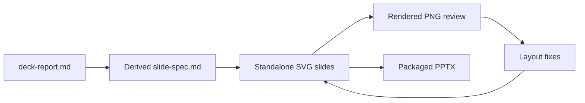

# SVG deck construction patterns

**Evidence cutoff:** August 25, 2026  
**Audience and purpose:** Authors evaluating the `build-deck-svg` workflow and its reusable slide patterns  
**Scope:** The seven patterns implemented by this example deck  
**Source status:** Grounded in the bundled SVG files, build scripts, themes, and pattern references

## Executive synthesis

The SVG builder treats each slide as standalone, diffable source and then packages those completed visuals into PowerPoint. Its strongest advantage is deterministic visual construction: typography, spacing, diagrams, tables, and raster chart assets can be inspected before packaging. The tradeoff is that a packaged slide is not a collection of native PowerPoint objects, so authors should choose this builder only when they explicitly prefer visual control over native editability.

## Construction model

The workflow separates content planning, SVG authoring, visual inspection, and packaging. This report preserves the complete explanation; the derived `slide-spec.md` records the builder's audience-facing choices and speaker notes.

The feedback loop matters because XML validity cannot detect wrapping, weak hierarchy, poor contrast, or accidental crowding.

## Demonstrated patterns

The example covers a title card, bullet and numbered lists, positioned tables, a Matplotlib chart, a native SVG flow diagram, and a combined table-plus-takeaways layout. Lists use coordinated `tspan` offsets so edits do not require manually repositioning every row. Tables remain explicitly positioned because tabular alignment is geometric rather than flowing prose. The chart is generated from reproducible Python source and embedded as an image, while the process diagram stays vector-based through SVG primitives.

## Theming and portability

Shared CSS classes define color and typography, while each SVG contains an inline canonical theme block for renderer compatibility. Images are embedded during packaging so the delivered deck has no external asset dependency. The same source can therefore be reviewed in version control, rendered independently, and rebuilt without hand-editing PowerPoint.

## Qualification

This workflow optimizes the slide as a finished visual artifact. Users who need to edit individual labels, boxes, tables, or chart series inside PowerPoint should instead explicitly choose `build-deck-pptx`.

## Sources

| Source | What it supports | Limitations |
|---|---|---|
| `slide-spec.md` | Derived slide sequence, visible content, and notes | Builder working state, not the standalone report |
| `slide-*.svg` | Actual layouts and SVG implementation patterns | Describes only the bundled example |
| `references/` | Pattern and compatibility guidance | Some guidance is renderer-specific |
| `scripts/build-pptx.py` | Packaging behavior | Produces visually complete slides, not native PowerPoint objects |
