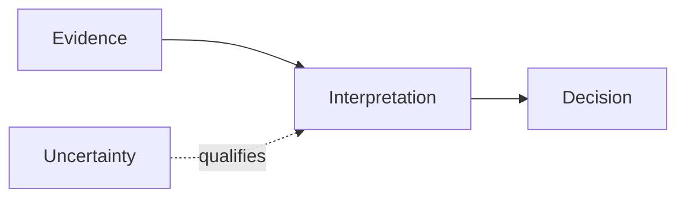

# Standalone deck report format

The report is a complete knowledge artifact, not an expanded slide outline. A reader should understand the subject, evidence, diagrams, and conclusions without seeing the eventual deck.

## Required opening

Start with:

- Report title
- Date or evidence cutoff
- Audience and purpose
- Scope and exclusions
- Source status, including important access or evidence limitations

Then write an executive synthesis in prose. It should explain the central conclusion, why it matters, and the strongest qualification. Do not turn it into a list of future slide bullets.

## Main body

Organize sections around the subject's reasoning rather than presentation mechanics. Useful structures include:

- current state → causes → consequences → recommended response
- question → evidence → interpretation → implication
- system context → component behavior → interactions → failure modes
- chronology → turning points → current position → next decisions

Each section should contain the details a future deck builder may need: exact values, examples, definitions, competing interpretations, and source references.

## Diagrams

Place diagrams in the section where they advance the explanation. Prefer inline Mermaid because both the source and rendered diagram stay in the report.

A diagram must have nearby prose explaining what the reader should learn from it. Do not include empty diagram placeholders or prose that merely requests a future diagram.

## Tables and data

Include complete data needed to support a claim. Preserve units, date ranges, definitions, denominators, and missing values. A summarized presentation may show only part of a table, but the report should retain the useful source detail.

## Sources

Use inline links or stable footnotes. For repository evidence, include repository-relative paths. Clearly label interpretation when a conclusion is synthesized from multiple sources.

End with a source register when the report depends on many artifacts:

| Source | What it supports | Accessed or updated | Limitations |
|---|---|---|---|
| ... | ... | ... | ... |

## Final quality check

The report is ready only when:

- it makes sense without a deck or verbal explanation
- it contains no slide numbers, layout directions, or proposed bullet wording
- important claims have detail and traceable evidence
- diagrams are present rather than described as future work
- diagrams can be understood from the report itself
- caveats and unresolved questions are explicit
- tables retain definitions and units
- placeholders and unsupported claims are gone or clearly marked
