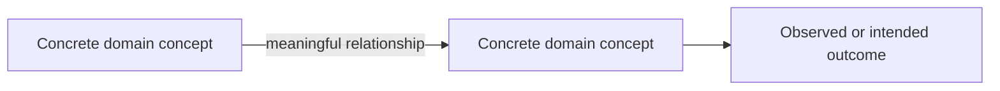

# <Report title>

**Evidence cutoff:** <date>  
**Audience and purpose:** <who needs to understand or decide what>  
**Scope:** <included subjects, time range, and exclusions>  
**Source status:** <coverage, access limitations, and unresolved gaps>

## Executive synthesis

<Explain the central conclusion, why it matters, the strongest supporting evidence, and the most important qualification in concise prose. This is a report summary, not slide copy.>

## Context and framing

<Define the problem, relevant terms, prior state, and why the question is being asked now.>

## <Finding or narrative section>

<State what matters, then explain the evidence, mechanism, examples, exact values, and implications. Preserve qualifications and competing interpretations.>

### <Diagram title>

<Explain what relationship the diagram captures and why it matters.>

<Interpret the diagram and identify any boundary, exception, or uncertainty that affects how it should be read.>

## <Evidence section>

<Develop the finding in prose. Use a table when readers need exact values or comparison detail.>

| Measure | Definition | Value | Period | Source or qualification |
|---|---|---:|---|---|
| ... | ... | ... | ... | ... |

## Implications and unresolved questions

<Explain consequences, decisions enabled by the evidence, material risks, and what remains unknown. Do not turn this into presentation recommendations or slide instructions.>

## Sources

| Source | What it supports | Accessed or updated | Limitations |
|---|---|---|---|
| ... | ... | ... | ... |
